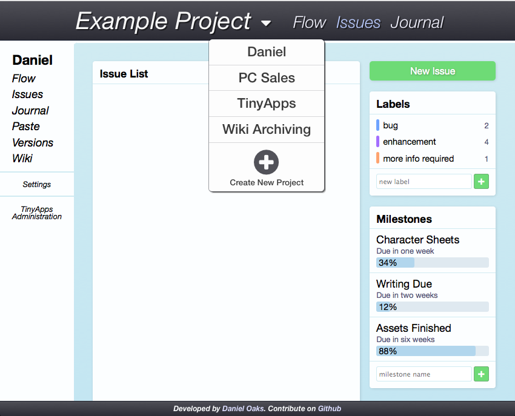

TinyApps
========
This is a collection of small webapps, designed to run off a local webserver on your computer and provide nice organisation software, issue-tracking, etc.

Running
-------
Simply cd to the tinyapps directory and run::

    pip3 install -r requirements.txt
    ./tinyapps

It starts up a local webserver on port 8080: `http://localhost:8080/ <http://localhost:8080/>`_

Using HTTPS
###########
You can run a server with HTTPS by generating or putting your keyfile at ``/privkey.pem`` and your certificate at ``/cert.pem``. To automatically generate a certificate and run an SSL server, run the code below::

    ./generate_cert
    ./tinyapps

**Note:** Unfortunately, CherryPy has an error with its SSL backend related to Python3 right now. However, this is fixed in my fork. Until it gets merged upstream, you can install my fork with::

    pip3 install https://github.com/DanielOaks/bottle/archive/cherry-ssl.zip --upgrade

Using PyPy
##########
TinyApps also supports running under PyPy (Python3). I'm aiming to keep this the same in the future, since PyPy can introduce very useful performance upgrades.

**Note:** PyPy support is currently also broken! This is because it doesn't have the ``datetime.datetime.timestamp()`` function that's introduced in Python3.3, so hopefully that'll get fixed soon. That said, I find it decently speedy right now anyway.

CSS Styling
-----------
We use `Compass <http://compass-style.org/>`_ and SASS to make our CSS handling a whole lot easier.

Simply `install Compass <http://compass-style.org/install/>`_ from the docs, then cd to the tinyapps directory and run::

    compass watch

Compass will automatically regenerate CSS files as you edit the base SASS files in ``static/sass``. Editing the CSS files in ``static/css`` directly is useless, since the changes will be overridden right away.

Screenshot
----------
Here is a screenshot of the current (early) design. Most of this is not actually hooked up on the backend yet, and mostly here as a little demonstration!

Contact
-------
The author of this project can be contacted at `daniel@danieloaks.net <mailto:daniel@danieloaks.net>`_

License
-------
This project is released under a BSD 2-clause license, as in the `license file <LICENSE>`_
